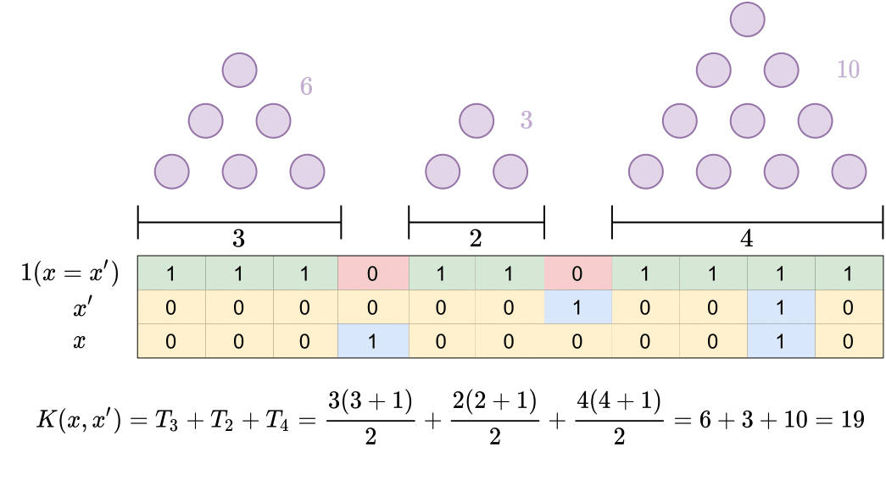

# String Kernel

Polynomial String Kernel and fast string kernel implementation as described in [our paper](https://www.biorxiv.org/content/10.1101/2021.09.19.460980v1).

Compatible and ready for easy plug-in to Scikit-Learn's Support Vector Machines. 

See the notebook *example.ipynb* for demonstration of easy use.

If you end up using this in your research we kindly ask you to cite us! :)
